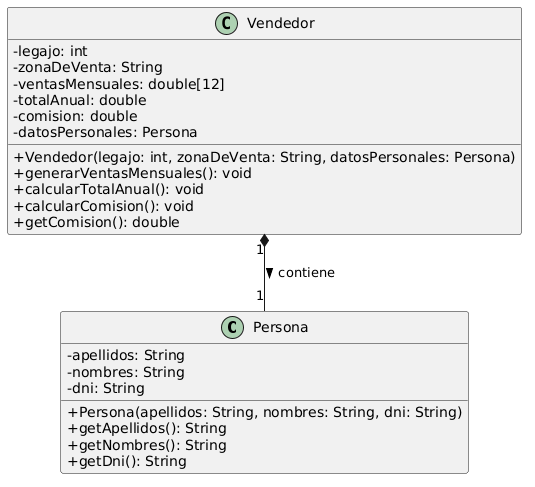

# Ejercicio 6 - Diagrama de Clases

### 1. La Relación: Composición (y por qué no es Agregación)
El diagrama plantea una relación de Composición (representada por el rombo negro `◆--`) entre `Vendedor` y `Persona`.

**El concepto de Entidad Fuerte y Débil:** Para entender esto, pensemos en la dependencia existencial. En este sistema, el `Vendedor` actúa como la entidad fuerte (el "todo") y los `datosPersonales` (la `Persona`) como una entidad débil (la "parte"). Si damos de baja a un `Vendedor` del sistema y destruimos ese objeto, sus datos personales específicos (ese registro de nombre y DNI atado a su legajo) también se destruyen. Hay una dependencia de "vida o muerte".

**¿Por qué NO es Agregación?** La agregación (rombo blanco `◇--`) se usa cuando la "parte" puede existir de forma independiente al "todo". Por ejemplo, un Club (todo) y un Socio (parte). Si el club cierra, la persona sigue existiendo. En el contexto estricto de este ejercicio, los datos personales no andan flotando libres por el sistema; nacen y mueren con el `Vendedor` que los contiene.

### 2. ¿Por qué NO es Herencia?
Al principio es muy tentador pensar: "Un vendedor es una persona, uso herencia". Sin embargo, el enunciado es explícito y nos da la regla de negocio: *"Los datos personales del vendedor se contienen en una instancia..."*.

* **La Herencia** responde a la pregunta "¿Es un...?" (Is-A).
* **La Composición** responde a la pregunta "¿Tiene un...?" (Has-A).

El diseño nos obliga a modelar que el `Vendedor` tiene una instancia de datos personales adentro, encapsulando esa información en lugar de heredarla directamente.

### 3. La Multiplicidad ("1 a 1")
En el diagrama vemos `Vendedor "1" ◆-- "1" Persona`.
Aunque la empresa tenga muchos vendedores en total, esta relación modela la estructura interna de un solo objeto a la vez. Se lee claramente como: "Un (1) Vendedor contiene exactamente un (1) registro de datos de Persona". No puede tener cero, ni puede tener dos.

### 4. Atributos de tipo "Clase"
En la clase `Vendedor`, vemos el atributo `- datosPersonales: Persona`.
Esto demuestra que una Clase no es más que un tipo de dato personalizado. Así como guardamos texto en un `String` o números enteros en un `int`, usamos el atributo `datosPersonales` para guardar un objeto entero y complejo (con su propio encapsulamiento) de tipo `Persona`.

### 5. Métodos: Procesos vs. Accesos (Y la ausencia de Setters)
Finalmente, el diseño de los métodos sigue el principio de Encapsulamiento y protege la integridad de los datos:

* **Métodos de Proceso (Lógica de negocio):** `calcularTotalAnual()` y `calcularComision()` son los motores de la clase. Agarran los datos, aplican las reglas del negocio (los porcentajes de $50k, $75k, etc.) y guardan el resultado internamente.
* **Métodos de Acceso (Getters):** `getComision()`, al igual que los getters en `Persona`, son simplemente "ventanas de lectura". Permiten que el programa principal (`main`) vea el resultado para imprimirlo en pantalla, sin poder alterarlo.

**¿Por qué NO hay `setComision`?** Porque la comisión es un dato calculado, no un dato puro. Si pusiéramos un `setComision`, cualquier programador podría inyectar un valor falso desde afuera y romper la coherencia del objeto (por ejemplo, asignar $100.000 de comisión a alguien que vendió $0). Si nos equivocamos en las ventas, se corrigen las ventas y se vuelve a invocar a `calcularComision()`, pero jamás se fuerza el resultado a mano.
